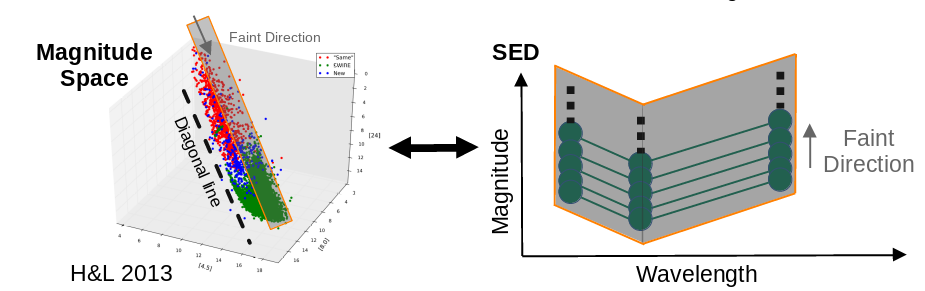

# Identifying Young Stellar Objects in Multi-dimensional Magnitude Space

# Context

## 1. Introduction
Young Stellar Objects (YSOs) are young stars at early stage of evolution. They are consists of protostar and pre-main-sequence stars.
Identifying YSOs is important to derive statistical properties e.g. star formation rate (SFR) which helps to better constrain star formation theories.

### 1.1 YSO Identification
There are two major approaches to do YSO identification: direct approach and indirect approach
- __Direct approach__: Find objects with feature of YSOs
    - Spectroscopy (pros: accurate; cons __NOT very efficient__)
- __Indirect approach__: Remove objects that are not YSOs
    - Evans et al. 2007: Color-color diagram (CCD), Color-magnitude diagram (CMD)
    - Hsieh and Lai 2013: Multi-D magnitude space (__this approach is adopted by this work__)
    - Chiu et al. 2021: Machine Learning

### 1.2 How Magnitude Space Works
Each location in magnitude space corresponds to a type of spectral energy distribution (SED) which can represent composition of objects.
This means classifying objects in magnitude space is equivalent to __classifying objects with SED based on their composition__.

|                            |
| :--:                                                                                |
| Blue/Green dots in 3D magnitude space corresponds to different types of 3-band SEDs |

For locations along the __faint direction__ (diagonal direction), SED shape of each location is identical but with different magnitude.
This can be viewed as the __same type of objects__ with different brightness due to the distance

|  |
| :---:                                                                                   |
| Green dots within orange probe in faint direction can be viewed as same type of objects |

However, since YSOs and galaxies have similar composition, both are made of star and dust, we cannot simply use SED shape to separate them.
But since their distances to us are very different, most YSOs we can observe locate within Milky Way Galaxy, as most galaxies are far-away from our Milky Way Galaxy.
Therefore, we __use their brightness difference to separate them__.
Note that this method has a caveat, since the separation of YSOs and galaxies are based on brightness, we might miss __very faint YSOs__ and contaminate YSOs with __very bright galaxies__.
Fortunately, there are no many very bright galaxies.

|                  |
| :--:                                                                                                    |
| Green/Blue dots within orange probe indicate Galaxies/YSOs separated due to their brightness difference |

## 3. Method
In this work, we use object samples to __naturally defined object-populated region__ in multi-D magnitude space.
The object will be classified into evolved star, star, galaxy or YSO __based on the object-populated region it locates__.
The concept of multi-D magnitude space is first proposed by Hsieh & Lai 2013, this work improves their work to the higher dimension.

|     |
| :--:                                                                 |
| Multi-D magnitude space in this work (2D magnitude space schematics) |

### 3.1 Find Object-populated Region
In Hsieh & Lai 2013, they use __multi-D array to construct the whole multi-D magnitude space__, however it needs enormous RAM to store that array.
To solve the RAM problem, in this work, we change the storage method from multi-d array to __2D array composed by sets of location of boundary points__.
We first project all object samples along the faint direction (as shown in previous section, they have identical SED shapes) to find all SED shapes of samples.
Then, we find __the brightest dot and the faintest dot for the individual type of SED shape__ and store them as __bright-end boundary__ and __faint-end boundary__ respectively.
In this work,  we assume object-populated region are always continuous, therefore the bright-end boundaries and faint-end boundaries define the object-populated region of the samples.

|                      |
| :--:                                                                                    |
| Probe green samples with orange probe and find both bright-end and faint-end boundaries |

### 3.2 Classification Pipeline
Input objects will first be __binned to save computation time__ and __compared their location in multi-D magnitude space to object-populated regions__ that are probed with the method in previous section.
Note that here we define the bright and faint regions to classify those objects outside the region of interest (where all samples locate) and give them object type bright and faint.
For those bright/faint objects, due to their brightness/faintness, we suggest them as YSOs/galaxies.

|  |
| :--:                                                                                            |
| This work classification pipeline with 2D magnitude space schematics                            |

### 3.3 Isolated Object and Reclassification Process
Since the multi-D magnitude space is huge and it is hard to observe all SED shapes in practice, there are some regions that do not have observed samples.
This region is called the __isolated region__ because of __missing SED shapes of samples__ and objects locate in this region are called __isolated objects__.

|                                                   |
| :--:                                                                                               |
| Isolated region defined in this work, which also indicates the region that we do not have samples |

To maximize usage of the samples, we introduce reclassification process to do classification to those isolated objects.
This process is to classify isolated objects using boundary points with the most similar SED as a reference.
This process acts equivalently to do interpolation/extrapolation to our samples.
Note that we only do this process to galaxy samples in this work.

|  |
| :--:                                                                |
| Reclassification process and detailed criteria                      |

## TL;DR How to use this tool?

### Preparation

#### 1. Install Required Python Packages (Python 3)
```bash
python3 -m pip install requirements.txt
```

#### 2. Prepare samples catalogs
This work needs three sample catalogs for evolved stars, stars and galaxies.

#### 3. Check Parameters
```bash
vim model.py
```

### Probe Object-populated Region
```bash
python3 ./run_probe_model.py
```

### Run Classification
```bash
python3 ./run_classification.py
```

### Visualization
```bash
python3 ./plot_sample_MMD.py
```


```bash
python3 ./plot_result_MMD.py
```


```bash
python3 ./plot_sample_SED.py
```


```bash
python3 ./plot_model_venn_diagram.py
```


