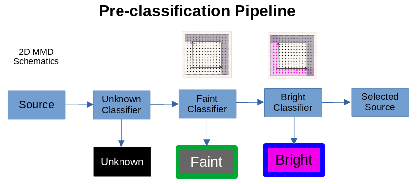
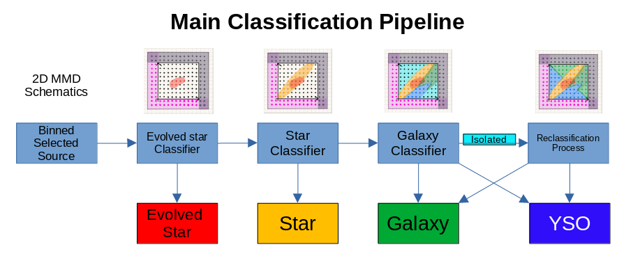

# Classification

# Context

## Pre-classification Pipeline
The input sources will first go through the pre-classification pipeline.
In this pipeline, the sources that do not have more than 2-band detection will be labeled as `unknown` by unknown classifier.
The surviving sources that are fainter than faint boundary of region of interest in any bands, they will be labeled as `faint` by faint classifier.
The surviving sources that are bright than bright boundary of region of interest in any bands, they will be labeled as `bright` by bright classifier.
This pre-classification pipeline is packed in `./classification.py`

|        |
| :--:                                                                             |
| Pre-classification Pipeline for input sources with 2D magnitude space schematics |

## Main Classification Pipeline
The selected sources will first be binned to save computation time.
The sources that locate in the evolved star region will be labeled as `evolved star` by evolved star classifier.
The surviving sources that locate in the star region will be labeled as `star` by star classifier.
The surviving sources that locate in in the region above the galaxy bright-end boundary will be labeled as `galaxy` by galaxy classifier.
And the surviving sources that locate in the region below the galaxy bright-end boundary will be labeled as `YSO` by galaxy classifier.
As for the sources that locate in the isolated region, they will be labeled as `isolated` by galaxy classifier and sent to reclassification process.
In reclassification process, the isolated objects are classified into `galaxy` or `YSO` by using the nearest galaxy bright-end boundary point as a reference and comparing their brightness difference.
This main classification pipeline is packed in `./classification.py`.

|                |
| :--:                                                                                       |
| Main Classification Pipeline for binned selected source with 2D magnitude space schematics |

## Input

### 1. Input Source Catalog
The input source catalog should be stored in text file with columns of magnitude in bands (`float`) and separated by space.
If there are bands that do not have detection for some sources, `-999.0` (`float`) must be assigned to that column in advance.

### 2. Input Object Sample Model
In this work, you need to assign object sample models for evolved stars, stars and galaxies.
This models can be generated by `../run_probe_model.py`

## Output

### 1. `classsification_result.txt`
- Classification result list composed by two parts
    - e.g. `1,1,1,1,1,1,1,1 RCYSO_RR_0.9_RH_17.3`
- The first part stores the band used in this classification (1: on, 0:off) separated by comma
    - e.g. `1,1,1,1,1,1,1,1`
- The second part stores the classified object type
    - e.g. `RCYSO_RR_0.9_RH_17.3`
    - If reclassification process is executed
        - Reclassified `galaxy`/`YSO` will be labeled as `RCGalaxy`/`RCYSO`
        - Length of RR appends after object type
        - Length of RH with +/- for faint/bright direction appends after object type

### 2. `XXX-ID.txt`, `XXX-SED_mag.txt`
- Object ID (`int`) in input catalog, object SED magnitude (`1D float array`) cut from input catalog
- All types of `XXX-ID.txt`, `XXX-SED_mag.txt`
    - `unknown-ID.txt`, `unknown-SED_mag.txt`
    - `faint-ID.txt`, `faint-SED_mag.txt`
    - `bright-ID.txt`, `bright-SED_mag.txt`
    - `evolved_star-ID.txt`, `evolved_star-SED_mag.txt`
    - `galaxy-ID.txt`, `galaxy-SED_mag.txt`
    - `star-ID.txt` , `star-SED_mag.txt`
    - `isolated-ID.txt`, `isolated-SED_mag.txt` (would be empty if reclassification process is executed)
    - `non_rc_isolated-ID.txt` (reclassification process ONLY)
    - `non_rc_galaxy-ID.txt` (reclassification process ONLY)
    - `non_rc_YSO-ID.txt` (reclassification process ONLY)
    - `rc_galaxy-ID.txt` (reclassification process ONLY)
    - `rc_YSO-ID.txt` (reclassification process ONLY)
