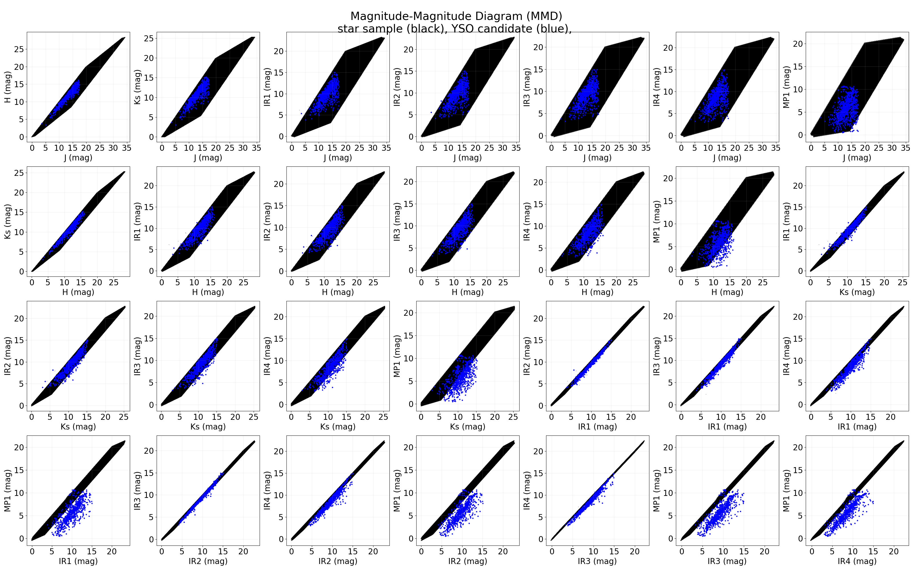
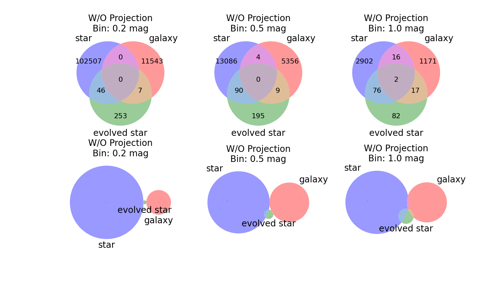

# Make Plot (Visualization)

## Magnitude-Magnitude Diagram (MMD)
- Generated by `../plot_samples_MMD.py` and `../plot_result_MMD.py` with module `./plot_MMD.py`
- This diagram show the distribution of samples in 2D magnitude-magnitude diagram for 8-band combination
    - 8 bands are J, H, K, IRAC1~4, and MIPS1
    - Star in black, evolved star in red, galaxy in green and YSO in blue

|                                                    |
| :--:                                                                                       |
| 2D MMD for evolved star, star and galaxy samples                                           |
|                                                    |
| 2D MMD for star sample and YSO identified from 8-band detected sources in C2D HREL catalog |

## Spectral Energy Distribution (SED)
-  Generated by `./plot_venn_diagram.py` with module `./plot_SED.py`

|  |
| :--:                                                         |
| SED for star, evolved star, galaxy and YSO samples           |

## Venn Diagram
- Generated by `../plot_model_venn_diagram.py` with module `./plot_venn_diagram.py`
- Venn diagrams are based on the grid location of models in different bin size
    - Venn diagram of model without projection shows
        - Relative volume size between sample models in magnitude space
        - Intersected volume size between sample models in magnitude space
    - Venn diagram of model with projection (on the J=0 plane) shows
        - Number of SED shapes that are covered by sample models
        - Similarity of SED shapes between sample models
    - Difference bin size can be useful to check resolution effect

|                |
| :--:                                                               |
| Venn Diagram for evolved star, star, and galaxy without projection |
|                |
| Venn Diagram for evolved star, star, and galaxy with projection    |
