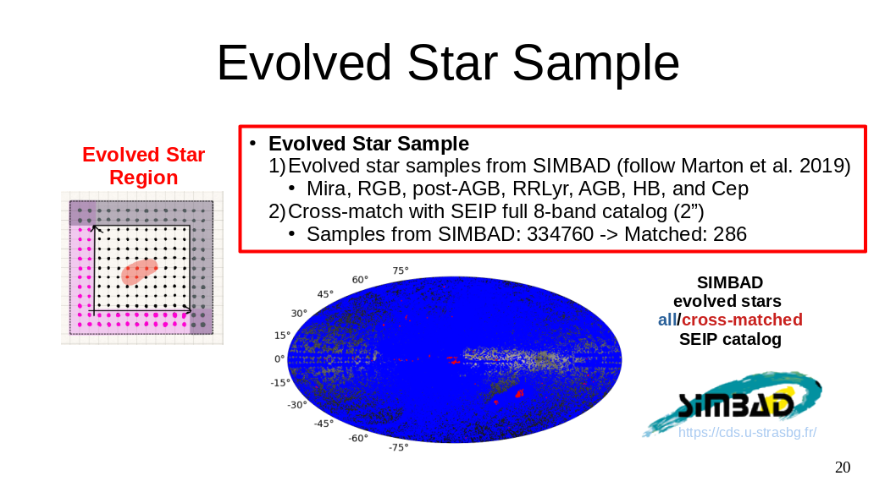
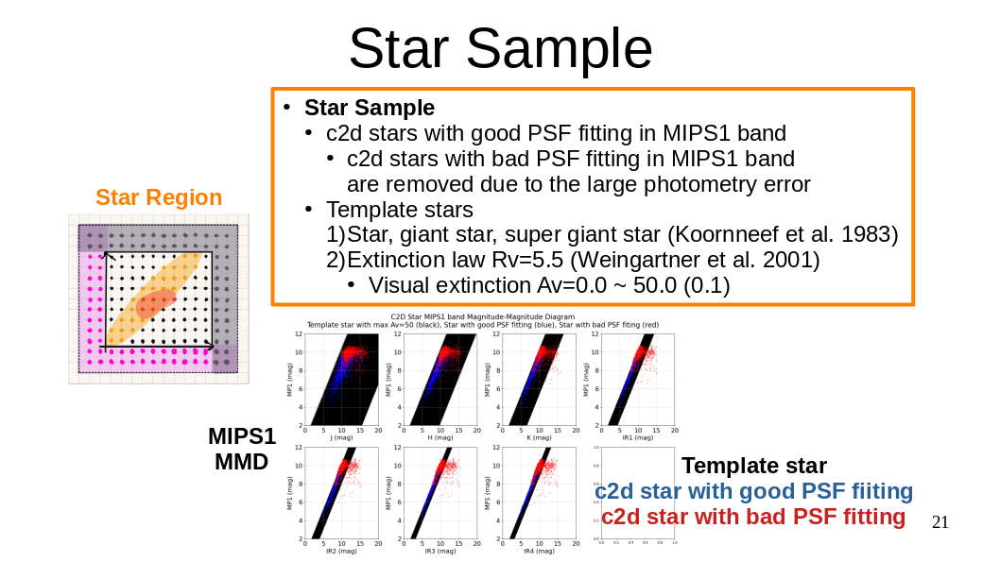
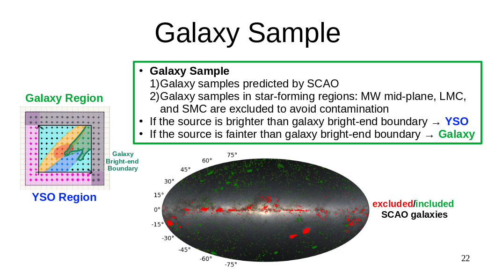

# Tables

# Context

## 1. Catalog Format
- __2D float array__ using __space__ as delimiter.
- If the source is not detected in a band, the value `-999.` should be assigned to magnitude of that band.
- In this work, we use 8-band catalog
    | J    | H    | K   | IRAC1 | IRAC2 | IRAC3 | IRAC4 | MIPS1 |
    | :--: | :--: | :-: | :--:  | :--:  | :--:  | :--:  | :--:  |
    | mag  | mag  | mag | mag   | mag   | mag   | mag   | mag   |

## 2. Catalog Source

### 2.1 Sample Object Catalog
- Here we provides sample object catalogs used in this work

#### Evolved Star Sample Catalog: `./evolved_star_SED_mag.txt`


#### Star Sample Catalog: `./star_SED_mag.txt`
- Since the star sample catalog is __too large__ for storage (~200 MB)
- Here we provides the script for users to generate star sample catalog by themselves
    ```bash
    ./generate_star_sample_catalog.sh
    ```




#### Galaxy Sample Catalog: `./galaxy_SED_mag.txt`


### 2.2 Input Object Catalog

#### Input Objects:`./C2D_HREL-ALL-SED_mag_exXU.txt`
- Source with all 8-band detection from C2D HREL catalog
